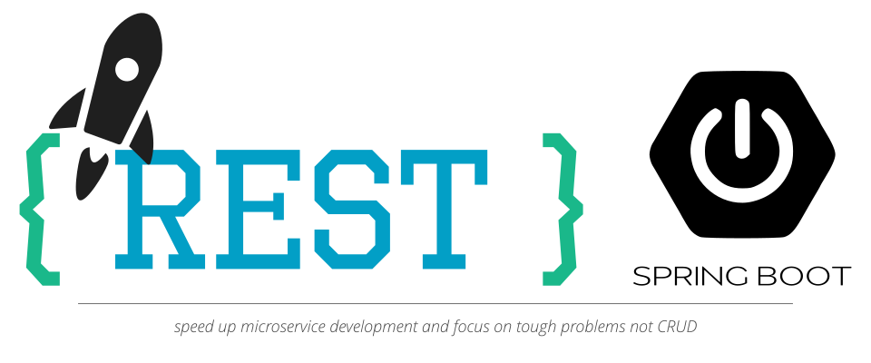

# commons-rest

Focus on tough problems and not on CRUD that the main focus of commons-rest. We [@rocketbase.io](https://www.rocketbase.io) develop many microservices and tried many tools and projects. All of them didn't matched our needs. By using for example [spring-data-rest](https://projects.spring.io/spring-data-rest/) you loose flexibility when you leave the basic path or by using [jHipster](http://www.jhipster.tech/) you have a full blown setup with many dependencies. Commons-rest focus on CRUD and leaves flexibility to you as developer. Additionally we've crafted a yeoman [project and service generator](https://github.com/rocketbase-io/generator-spring-rest-commons) in order to write less code :)

The implementation bases on spring-boot: mainly on **spring-mvc** and **spring-data** 

We believe in separation of Entity and DTO. We go one step forward and separate also the DTO into Read (response structure) and Write (create/update structure). This has many advantages for example separation of concern and allow edit by reference id and response with object. Furthermore it improves readability.

Conversion between each object can be automatically generated with [mapstruct](http://mapstruct.org/) see sample-project for details.

**Features:**
* basic DTOs as per example a missing PageableResult
* custom RuntimeExceptions, ExceptionHandler and BeanValidationExceptions
* abstract CRUD controller also for parent child situations
* abstract CRUD resources to consume REST-Services 
* prodivded a [project and service generator](https://github.com/rocketbase-io/generator-spring-rest-commons) via yeoman
* provided a jwt security module that is simply pluggable name [commons-auth](https://github.com/rocketbase-io/commons-auth)

## commons-rest-api

This module provides some useful runtime exceptions like NotFoundException and basic DTO classes. Mainly ErrorResponse for rending details to error and also field-validation exceptions (this is handled a BeanValidationExceptionHandler provided by rest-server) and PageableResult to provide results in a paged wrapper. Additionally, you can find abstract implements of resources to consume REST-Services within java-code by use of RestTemplate and Jackson.

## commons-rest-server

Containing ExceptionHandlers for common errors like BeanValidationExceptions or the custom NotFoundException. Abstract classes to implement CRUD SpringRestController. Also a parent child solution is provided.

### configuration

This module uses the auto configuration feature of spring-boot-starter so that all necessary beans will get configured automatically.
Nevertheless you can customize the configuration by the following properties

| property                       | default         | explanation                                                  |
| ------------------------------ | --------------- | ------------------------------------------------------------ |
| locale.resolver.enabled        | true            | enable/disable default configuration of the LocaleResolver   |
| locale.resolver.default        | en              |                                                              |
| handler.badRequest.enabled     | true            | enable/disable ExceptionHandler for BadRequestException      |
| handler.notFound.enabled       | true            | enable/disable ExceptionHandler for NotFoundException        |
| handler.beanValidation.enabled | true            | enable/disable ExceptionHandler for MethodArgumentNotValidException (bean validation issues from spring-boot)      |
 

## commons-rest-sample

Sample spring-boot application to demonstrate the use of the provided commons-rest libraries. 

### The MIT License (MIT)
Copyright (c) 2018 rocketbase.io

Permission is hereby granted, free of charge, to any person obtaining a copy of this software and associated documentation files (the "Software"), to deal in the Software without restriction, including without limitation the rights to use, copy, modify, merge, publish, distribute, sublicense, and/or sell copies of the Software, and to permit persons to whom the Software is furnished to do so, subject to the following conditions:

The above copyright notice and this permission notice shall be included in all copies or substantial portions of the Software.

THE SOFTWARE IS PROVIDED "AS IS", WITHOUT WARRANTY OF ANY KIND, EXPRESS OR IMPLIED, INCLUDING BUT NOT LIMITED TO THE WARRANTIES OF MERCHANTABILITY, FITNESS FOR A PARTICULAR PURPOSE AND NONINFRINGEMENT. IN NO EVENT SHALL THE AUTHORS OR COPYRIGHT HOLDERS BE LIABLE FOR ANY CLAIM, DAMAGES OR OTHER LIABILITY, WHETHER IN AN ACTION OF CONTRACT, TORT OR OTHERWISE, ARISING FROM, OUT OF OR IN CONNECTION WITH THE SOFTWARE OR THE USE OR OTHER DEALINGS IN THE SOFTWARE.