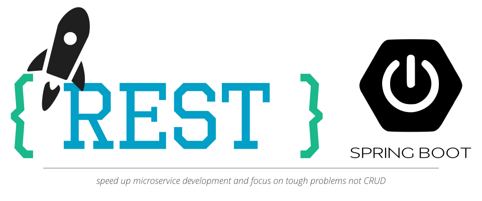

# commons-rest




[](https://mvnrepository.com/artifact/io.rocketbase.commons/commons-rest)

### 📖 [Documentation](https://commons-rest.rocketbase.io/) — guides, examples & release notes

Focus on tough problems and not on CRUD — that's the main focus of commons-rest.
We [@rocketbase.io](https://www.rocketbase.io) develop many microservices and tried many tools
and projects. All of them didn't match our needs: with [spring-data-rest](https://projects.spring.io/spring-data-rest/)
you lose flexibility the moment you leave the basic path, full-blown generators bring a mountain
of dependencies. commons-rest provides small, focused building blocks at the API boundary and
leaves the architecture to you — plain Spring MVC controllers, full control.

We believe in the separation of Entity and DTO — and go one step further by splitting the DTO
into **Read** (response) and **Write** (create/update) types. See
[Concepts](https://commons-rest.rocketbase.io/concepts/) for the reasoning.

**This is v4, based on spring-boot 4 / spring-framework 7 / jackson 3.** For spring-boot 3 use
the latest 3.5.x release — the docs website covers v4 only, migration details in the
[migration guide](https://commons-rest.rocketbase.io/migration-v4/).

## features

- [RFC 9457 problem details](https://commons-rest.rocketbase.io/error-handling/) out of the box:
  throw `NotFoundException` & co. anywhere, get `application/problem+json` — including a
  per-field map for bean-validation errors
- [`PageableResult`](https://commons-rest.rocketbase.io/pagination/): a serializable,
  framework-neutral pagination DTO with a stable JSON shape
- [TypeScript client generation](https://commons-rest.rocketbase.io/typescript-clients/):
  axios clients, react-query hooks and zod schemas straight from your annotated controllers
- ids that don't leak: [hashids-obfuscated](https://commons-rest.rocketbase.io/obfuscated-ids/)
  or [TSID](https://commons-rest.rocketbase.io/tsid/) identifiers, decoded transparently in
  path variables, params and JSON
- [i18n translations](https://commons-rest.rocketbase.io/i18n/), [request/method logging](https://commons-rest.rocketbase.io/logging/),
  [error pages](https://commons-rest.rocketbase.io/error-pages/) and a bag of
  [utilities](https://commons-rest.rocketbase.io/utilities/)
- everything auto-configured, everything optional: every bean is `@ConditionalOnMissingBean`,
  every feature has an [off-switch property](https://commons-rest.rocketbase.io/configuration/)

## modules

| module | what it adds |
|---|---|
| `commons-rest-api` | DTOs, exceptions, converter interface, annotations — safe to share between services |
| `commons-rest-server` | auto-configured exception handlers, locale resolver, enum converter |
| `commons-rest-hashids` | hashids-obfuscated ids |
| `commons-rest-tsid` | TSID (time-sorted id) support |
| `commons-rest-openapi` | TypeScript client + react-query hook generation |
| `commons-rest-logging-aspect` | request & method logging via AOP |
| `commons-rest-errorpage` | styled static HTML error pages |

## usage

```xml
<dependency>
    <groupId>io.rocketbase.commons</groupId>
    <artifactId>commons-rest-server</artifactId>
    <version>4.0.0-M2</version>
</dependency>
```

```java
@RestController
@RequestMapping("/api/employee")
@RequiredArgsConstructor
public class EmployeeController {

    private final EmployeeRepository repository;
    private final EmployeeConverter converter;

    @GetMapping
    public PageableResult<EmployeeRead> list(@PageableDefault(size = 25) Pageable pageable) {
        return PageableResult.fromPage(repository.findAll(pageable), converter::fromEntity);
    }

    @GetMapping("/{id}")
    public EmployeeRead getById(@PathVariable String id) {
        return converter.fromEntity(repository.findById(id)
                .orElseThrow(NotFoundException::new));
    }

    @PostMapping
    public EmployeeRead create(@RequestBody @Valid EmployeeWrite write) {
        return converter.fromEntity(repository.save(converter.newEntity(write)));
    }
}
```

A failing `@Valid` request answers without any code on your side:

```json
{
  "type": "urn:problem-type:form-error",
  "title": "Bad Request",
  "status": 400,
  "detail": "invalid form",
  "fields": {
    "email": ["must not be empty"]
  }
}
```

Head over to [Getting Started](https://commons-rest.rocketbase.io/getting-started/) for the
full tour, or explore the runnable [sample application](https://commons-rest.rocketbase.io/sample-application/)
in [`sample/`](sample/).

### The MIT License (MIT)

Copyright (c) 2019 rocketbase.io

Permission is hereby granted, free of charge, to any person obtaining a copy of this software and associated
documentation files (the "Software"), to deal in the Software without restriction, including without limitation the
rights to use, copy, modify, merge, publish, distribute, sublicense, and/or sell copies of the Software, and to permit
persons to whom the Software is furnished to do so, subject to the following conditions:

The above copyright notice and this permission notice shall be included in all copies or substantial portions of the
Software.

THE SOFTWARE IS PROVIDED "AS IS", WITHOUT WARRANTY OF ANY KIND, EXPRESS OR IMPLIED, INCLUDING BUT NOT LIMITED TO THE
WARRANTIES OF MERCHANTABILITY, FITNESS FOR A PARTICULAR PURPOSE AND NONINFRINGEMENT. IN NO EVENT SHALL THE AUTHORS OR
COPYRIGHT HOLDERS BE LIABLE FOR ANY CLAIM, DAMAGES OR OTHER LIABILITY, WHETHER IN AN ACTION OF CONTRACT, TORT OR
OTHERWISE, ARISING FROM, OUT OF OR IN CONNECTION WITH THE SOFTWARE OR THE USE OR OTHER DEALINGS IN THE SOFTWARE.
